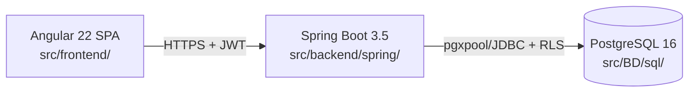

# Arquitetura — Visão Geral — Petshop PetLover

> Exemplo de snapshot gerado por `/generate-architecture --stack=all`.

## Fluxo request → response (crítico)

## Autenticação

- JWT RS256 com `kid` rotacional via JWKS pública.
- Access ≤ 15 min; refresh cookie HttpOnly Secure SameSite=Strict.
- Backend lê `tenant_id` claim; RLS refina via `SET LOCAL app.tenant_id`.

## Stacks ativas

| Stack | Raiz | Doc técnico |
| ----- | ---- | ----------- |
| Angular 22 | `src/frontend/` | `docs/architecture/frontend-angular.md` |
| Spring Boot 3.5 | `src/backend/spring/` | `docs/architecture/backend-spring.md` |
| PostgreSQL 16+ | `src/BD/` | `docs/architecture/database-postgres.md` |

## ADRs relevantes

- (não resolvidos neste example)

## Pontos de atenção

- Multi-tenant via RLS — toda query bypass sem `SET LOCAL app.tenant_id` deve ser
  auditada periodicamente.
- Virtual threads (Spring) — evitar `synchronized` em volta de JDBC.

## Não metas

- Não é auditoria de conformidade.
- Não substitui o `01-context/`.