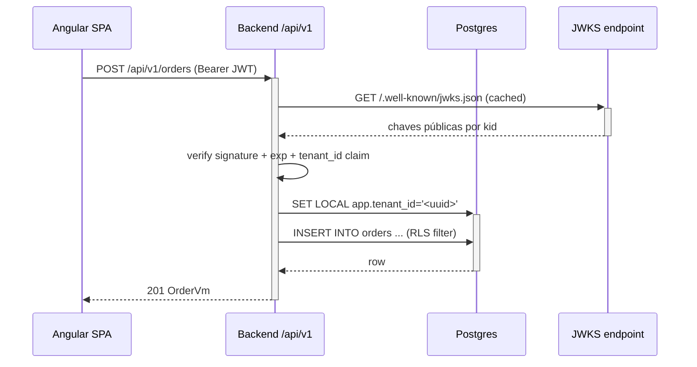

# Mermaid para diagramas de arquitetura

Use Mermaid (suportado no GitHub/VSCode/GitLab native). Sem ASCII art. Sem imagens.

## Diagrama de componentes (flowchart)

```mermaid
flowchart LR
  subgraph Front[Frontend — Angular 22]
    OrdersComponent[orders.component.ts\nsignals + httpResource]
    CartService[cart.service.ts\nsignal store]
  end

  subgraph Back[Backend — Spring Boot 3.5]
    OrderController[OrderController\n@RestController]
    OrderService[OrderService\n@Transactional]
    OrderRepo[OrderRepository\nJpaRepository]
  end

  subgraph DB[BD — PostgreSQL 16]
    OrdersTable[(orders)]
    RLS[RLS policy\ntenant_isolation]
  end

  OrdersComponent -->|HTTPS + JWT| OrderController
  OrderController --> OrderService
  OrderService --> OrderRepo
  OrderRepo -->|pgxpool/Flyway| OrdersTable
  OrdersTable --- RLS
```

Notas:
- `subgraph` agrupa por stack — ajuda leitura cross-stack
- Use `\n` dentro de label para nova linha dentro do nó (renderiza com label quebrado)
- Nome do node curto; label descritivo (`node[texto]`)
- Caminhos reais como `node[label]` sempre que possível

## Diagrama de sequência (sequenceDiagram)

Para fluxo request → response crítico (ex.: checkout, login):



## Diagrama ER (entityRelationship)

Para BD:

```mermaid
entityRelationship
  CUSTOMERS ||--o{ ORDERS : "places"
  ORDERS ||--|{ ORDER_ITEMS : "contains"
  CUSTOMERS {
    uuid id PK
    text email
    timestamptz created_at
  }
  ORDERS {
    uuid id PK
    uuid tenant_id FK
    varchar external_ref
    order_status status
  }
```

## Diagrama C4 nível Container

Use `flowchart` com subgraphs para C4 nível 2 — mais portátil que `C4Context` (suporte
ainda variável entre renderers).

## Regras duras

- **Sem ASCII art** — quebra diff review e não renderiza em todas as platforms.
- **Sem imagens externas** (``) — dependem de hospedagem externa; diff perde.
- **Labels curtos + caminho real** — mais fácil de grep quando há mudança.
- **Subgraphs por stack** — overview vs stack-isolado tem definicão de fronteira clara.
- **Não descreva tudo** — só os caminhos críticos. Detalhe fica nos docs de cada stack.