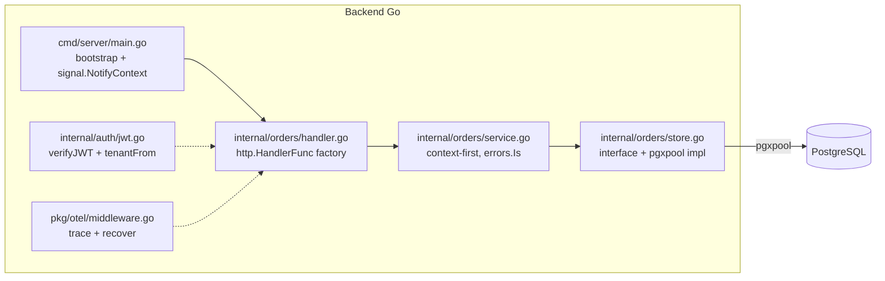

# Arquitetura — Go 1.23+

> Compilado por `architecture-writer` a partir do agente `go-arquiteto` +
> `skills/stacks/go/references/arquitetura.md`. Atualize via
> `/generate-architecture --stack=go`.

## Visão de camada

Backend REST em Go 1.23+ (módulos). Layout standard Go project (`cmd/<app>/main.go`,
`internal/<dominio>/`). Camadas: handler (`http.HandlerFunc` factory) → service (context-
  first) → store (interface no consumer-side). pgxpool para Postgres.

## Componentes

## Decisões não óbvias

- **`http.ServeMux` (Go 1.22+ method+pattern) em vez de chi/gin/echo** — uma dependência
  a menos para auditar; stdlib supre REST semântico. Alternativas (chi por route groups,
  gin por auto-bind) descartadas em novo projeto.
- **Interfaces no consumer-side** (service declara `OrderStore interface { ... }`) — fake
  in-memory em testes é trivial; impl de BD isolada para troca por sqlc sem tocar service.
  Alternativa: interface no store package (acoplamento inverso) descartada.
- **errors sentinelas + `%w`** para branching — claros no `errors.Is`. Alternativa:
  `error` como string (perde cadeia causa) descartada.

ADRs: _preencher linkando `03-decisions/ADR-NNN-*.md` quando existentes._

## Contratos publicados

Endpoints:

- `POST /api/v1/orders` (JSON body CreateOrderRequest) → 201 OrderResponse | 400 | 409 | 401
- ...

## Mapeamento para `01-context/`

- `01-context/ARCHITECTURE_OVERVIEW.md` §Camadas
- `01-context/api-context.md`
- `01-context/constraints.md`

## Não metas

- Não documenta queries SQL — ver `docs/architecture/database-postgres.md`.
- Não documenta testes — ver `docs/testing/test-plan-backend-go.md`.