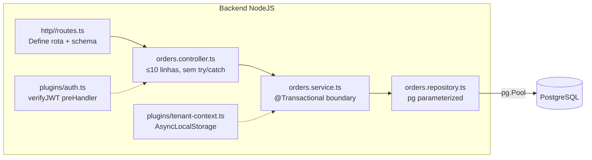

# Arquitetura — Node.js 22+

> Compilado por `architecture-writer` a partir do agente `nodejs-arquiteto` +
> `skills/stacks/nodejs/references/arquitetura.md`. Atualize via
> `/generate-architecture --stack=nodejs`.

## Visão de camada

Backend REST em Node.js 22+ (ESM) com Fastify/Express5/NestJS. Camadas: routes → handlers
→ services (+ tx) → repositories. Thread único (event loop) — IO não bloqueante, CPU-bound
via worker threads.

## Componentes

## Decisões não óbvias

- **Tx no service, repo recebe `client`** — mantém repo livre de decisão transacional,
  permite substituir implementação sem tocar regra. Alternativa: tx no controller (acopla
  HTTP a persistência) descartada.
- **AsyncLocalStorage para tenant/requestId** — `req.log`/service leem do ALS sem
  acoplamento de parâmetros. Alternativa: passar `tenantId` em toda assinatura (verbose,
  fácil esquecer em camada nova) descartada.
- **pino em JSON com redact** — performance e redação automática de PII. Alternativa:
  winston (startup + overhead) descartada.

ADRs: _preencher linkando `03-decisions/ADR-NNN-*.md` quando existentes._

## Contratos publicados

Endpoints:

- `GET /api/v1/orders?status=open&cursor=...` → 200 `OrdersPageVm` | 401 | 403
- `POST /api/v1/orders` → 201 `OrderVm` | 400 bad_request | 409 conflict
- ...

Detalhes de schema em `01-context/api-context.md`.

## Mapeamento para `01-context/`

- `01-context/ARCHITECTURE_OVERVIEW.md` §Camadas — diagrama cross-stack.
- `01-context/api-context.md` — contratos publicados.
- `01-context/constraints.md` — limites de backend (event loop intocado, schema em toda
  request, etc.).

## Não metas

- Não documenta queries SQL — ver `docs/architecture/database-postgres.md`.
- Não documenta testes — ver `docs/testing/test-plan-backend-nodejs.md`.