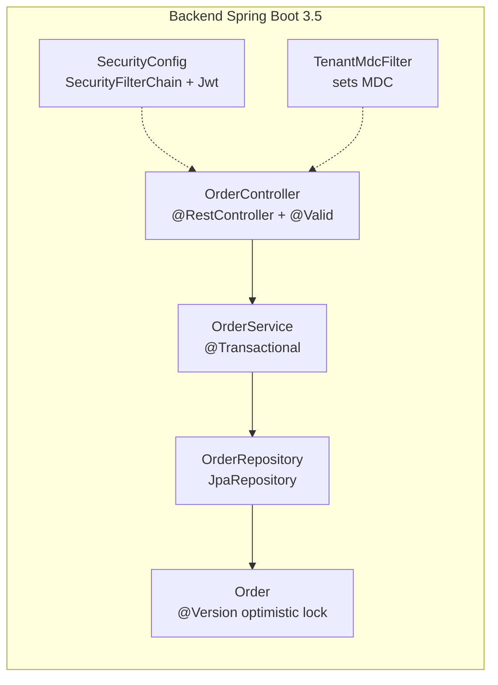

# Arquitetura — Java 21+ / Spring Boot 3.5

> Compilado por `architecture-writer` a partir do agente `spring-arquiteto` +
> `skills/stacks/spring/references/arquitetura.md`. Atualize via
> `/generate-architecture --stack=spring`.

## Visão de camada

Backend REST em Spring Boot 3.5 (Java 21 + virtual threads). Camadas: Controller →
Service (`@Transactional`) → Repository (JPA) → Entity (`@Version`). Spring Security 6
stateless via OAuth2 Resource Server JWT. Flyway versiona schema.

## Componentes

## Decisões não óbvias

- **Virtual threads on + `ReentrantLock` em vez de `synchronized`orrente IO** — avoid
  pinning de carrier thread. Alternativa: `synchronized` (causa pin) descartada para hot
  path.
- **Records para DTOs** — imutabilidade sem Lombok. Alternativa: `@Data` Lombok
  (complicação de debug, conflito com records) descartada em código novo.
- **Spring Data JPA + Flyway (`validate`)** — Flyway como source of truth de schema; JPA
  apenas mapeia. Alternativa: `ddl-auto=update` (destruiu schema em prod já) descartada.
- **`@EntityGraph` / projections para evitar N+1** — hot path de listagem não carrega
  entidades completas. Alternativa: fetch lazy +次次 acesso (N+1 literal) descartada.

ADRs: _preencher linkando `03-decisions/ADR-NNN-*.md` quando existentes._

## Contratos publicados

Endpoints:

- `POST /api/v1/orders` (CreateOrderDto record) → 201 OrderVm | 400 | 409 | 401
- `GET /api/v1/orders/{id}` → 200 OrderVm | 404 | 401 | 403
- ...

## Mapeamento para `01-context/`

- `01-context/ARCHITECTURE_OVERVIEW.md` §Camadas
- `01-context/api-context.md`
- `01-context/constraints.md`

## Não metas

- Não documenta migrations SQL — ver `docs/architecture/database-postgres.md`.
- Não documenta testes — ver `docs/testing/test-plan-backend-spring.md`.