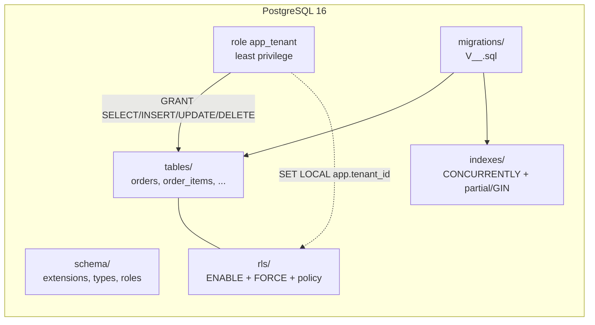

# Arquitetura — PostgreSQL 16+

> Compilado por `architecture-writer` a partir do agente `postgres-arquiteto` +
> `skills/stacks/postgres/references/arquitetura.md`. Atualize via
> `/generate-architecture --stack=postgres`.

## Visão de camada

PostgreSQL 16+ hospedando dados multi-tenant. RLS ativa em toda tabela com `tenant_id`,
migrations versionadas append-only via Flyway/golang-migrate, JSONB+GIN para dados
flexíveis, particionamento declarativo para alta-volume.

## Componentes



## ER (entidades principais)

```mermaid
entityRelationship
  CUSTOMERS ||--o{ ORDERS : "places"
  ORDERS ||--|{ ORDER_ITEMS : "contains"
  CUSTOMERS { uuid id PK
    text email
    timestamptz created_at }
  ORDERS { uuid id PK
    uuid tenant_id
    varchar external_ref
    order_status status }
  ORDER_ITEMS { uuid id PK
    uuid order_id FK
    int qty }
```

## Decisões não óbvias

- **`uuid` (Default `gen_random_uuid()`) como PK** — sem contenção de sequence, distribui
  bem em sharding futuro. Alternativa: `bigint GENERATED ALWAYS AS IDENTITY` (mais simples
  em 1 instância) descartada para prepares mid-to-high volume.
- **RLS + `FORCE` em toda tabela multi-tenant** — blindagem de scripts admin/equipe em
  manutenção; não apenas "app faz WHERE tenant_id = $1". Alternativa: isolamento só em
  app (frágil, já que DB loose a bypass via admin role) descartada.
- **Migrations append-only com `CONCURRENTLY` fora-de-tx** — escala sem lock em prod.
  Alternativa: `CREATE INDEX` inline (lock SHARE que para writes) descartada em volume.

ADRs: _preencher linkando `03-decisions/ADR-NNN-*.md` quando existentes._

## Contratos publicados

Tipos SQL exportados (consumidos por app via mapa manual ou `sqlc`):

- `CREATE TYPE order_status AS ENUM ('open','paid','shipped','cancelled','returned')`
- `TABLE orders (id uuid PK, tenant_id uuid, external_ref varchar(64), status order_status, ...)`

Schema completo persistido em `src/BD/sql/`. Snapshot `pg_dump --schema-only` opcional em
release.

## Mapeamento para `01-context/`

- `01-context/ARCHITECTURE_OVERVIEW.md` (BD é tangente de backend via pgxpool/HikariCP/Druid).
- `01-context/constraints.md` — limites de BD (RLS obrigatória, `timestamptz`, etc.).

## Não metas

- Não documenta queries específicas de app — ver docs de cada backend.
- Não documenta backup/DR/runbook — operation side.