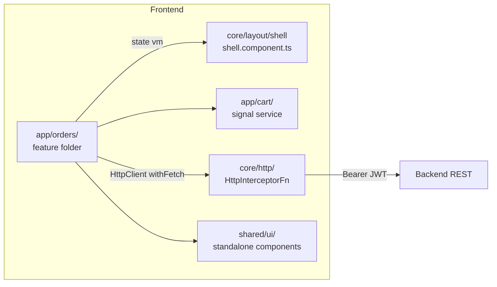

# Arquitetura — Angular 22

> Compilado por `architecture-writer` a partir do agente `angular-arquiteto` +
> `skills/stacks/angular/references/arquitetura.md`. Atualize via
> `/generate-architecture --stack=angular`.

## Visão de camada

SPA Angular 22 (standalone, signals, zoneless) consumindo API REST no backend. Sem regra
de negócioAutoritativa — autorização final é server-side. Hidratação ativa para SSR.

## Componentes

## Decisões não óbvias

- **Signals + zoneless** — sem `ChangeDetectionStrategy.OnPush` manual; `markForCheck`
  proibido. Razão: zoneless + signals é o caminhoAngular 22; alternativas (`NgZone.run`,
  `ApplicationRef.tick`) quebram virtual thread-style de change detection.
- **`httpResource` para consultas** — cache + refetch controlado sem boilerplate RxJS.
  Razão: hot path de listagem; alternativas (`BehaviorSubject`+`switchMap`), mais código
  sem benefício.
- **`@if/@for/@switch` no template** — AOT puro, sem `NgIf` legacy que implica bitwise no
  bundle.

ADRs: _preencher linkando `03-decisions/ADR-NNN-*.md` quando existentes._

## Contratos publicados

Componentes exportados via `standalone: true`:

- `OrdersComponent` — inputs: `tenantId` (`input.required<string>()`); output: `selected`
  (`output<OrderVm>()`); consulta externa: `httpResource<OrdersResponse>`.
- ...

## Mapeamento para `01-context/`

- `01-context/ARCHITECTURE_OVERVIEW.md` §Camadas — diagrama cross-stack.
- `01-context/api-context.md` — contratos consumidos pelo Angular nas rotas `/api/v1/*`.
- `01-context/constraints.md` — limites de frontend (sem regra de negócioAutoritativa, etc.).

## Não metas

- Não documenta biblioteca de UI por componente (isso sao JSDoc/Storybook).
- Não documenta testes individuais (ver `docs/testing/test-plan-frontend-angular.md`).