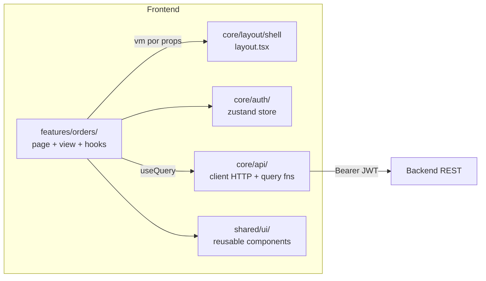

# Arquitetura — React 19+

> Compilado por `architecture-writer` a partir do agente `react-arquiteto` +
> `skills/stacks/react/references/arquitetura.md`. Atualize via
> `/generate-architecture --stack=react`.

## Visão de camada

SPA React 19+ (Vite + TypeScript, function components + hooks) consumindo API REST no
backend. Server state via TanStack Query; client state mínimo via Zustand (cross-feature).
Sem regra de negócio canônica — autorização final é server-side.

## Componentes

## Decisões não óbvias

- **TanStack Query para server state** — cache + refetch + estados `isPending/isError`
  sem boilerplate de estado. Razão: hot path de listagem; alternativas (SWR, fetch +
  `useEffect`), mais código sem benefício.
- **Zustand só cross-feature** — estado local/descartável fica em `useState`; store só onde
  há consumo multi-feature (auth, perfil). Razão: evita re-render e over-engineering;
  Redux descartado.
- **React.lazy + Suspense por rota** — bundle sob demanda; guard `RequireScope` impede
  download de bundle restrito antes da autorização.

ADRs: _preencher linkando `03-decisions/ADR-NNN-*.md` quando existentes._

## Contratos publicados

Componentes/hooks exportados:

- `OrdersPage` — conecta `useOrders(params)`; `OrdersView` recebe `vm` por props
  (`{ items, loading, error }`).
- `useOrders(params: OrderListParams)` — `{ data, isPending, isError, refetch }` via Query.
- `core/api/orders.ts` — `listOrders`, `createOrder` (erros tipados `ApiError`).

## Mapeamento para `01-context/`

- `01-context/ARCHITECTURE_OVERVIEW.md` §Camadas — diagrama cross-stack.
- `01-context/api-context.md` — contratos consumidos pelo React nas rotas `/api/v1/*`.
- `01-context/constraints.md` — limites de frontend (sem regra de negócio canônica, etc.).

## Não metas

- Não documenta biblioteca de UI por componente (isso é Storybook/JSDoc).
- Não documenta testes individuais (ver `docs/testing/test-plan-frontend-react.md`).
