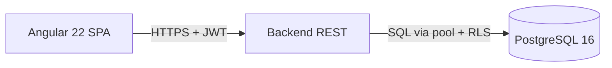

# Arquitetura — Visão Geral

> Gerado por `/generate-architecture` a partir das saídas dos 6 agentes `<stack>-arquiteto`.
> Atualize re-rodando o comando após mudanças irreversíveis documentadas em `03-decisions/`.

## Fluxo request → response (crítico)

Detalhes do fluxo em cada doc técnico (`frontend-angular.md`, `backend-<stack>.md`,
`database-postgres.md`).

## Autenticação e Autorização

- JWT RS256/ES256 com `kid` rotacional; JWKS pública (<8k request do frontend).
- Access token ≤ 15 min em memória; refresh token cookie HttpOnly Secure SameSite=Strict
  ≤ 7 dias rotacional.
- Backend lê `tenant_id` claim; RLS em Postgres refina isolamento via `current_setting`.

## Stacks ativas

| Stack | Raiz | Doc técnico |
| ----- | ---- | ----------- |
| Angular 22 | `src/frontend/` | `docs/architecture/frontend-angular.md` |
| React 19+ | `src/react/` | `docs/architecture/frontend-react.md` |
| Node.js 22+ | `src/backend/nodejs/` | `docs/architecture/backend-nodejs.md` |
| Spring Boot 3.5 | `src/backend/spring/` | `docs/architecture/backend-spring.md` |
| Go 1.23+ | `src/backend/go/` | `docs/architecture/backend-go.md` |
| PostgreSQL 16+ | `src/BD/` | `docs/architecture/database-postgres.md` |

> Stacks inativas em `ia-framework/STACK.md` => doc omitido.

## ADRs relevantes

- `03-decisions/ADR-001-<slug>.md` — <assunto>
- Preencha manualmente conforme ADRs.

## Pontos de atenção (armadilhas conhecidas)

- <preencha com armadilhas conhecidas que afetam múltiplas stacks>
- Virtual threads (Spring) e event loop (Node/Go) não bloqueiam em IO síncrono de BD
- RLS blinda bypass de admin scripts — combinado com grants least-privilege

## Não metas

- Este documento **não** é auditoria de conformidade.
- **Não** substitui o `01-context/` — este é snapshot per-release, contexto é memória
  viva de dev.
- **Não** é documentation de API — OpenAPI/Swagger serve.